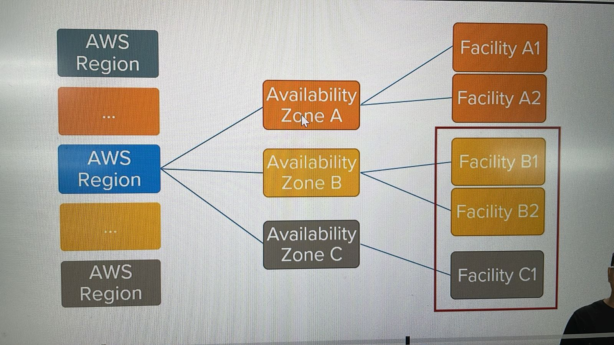
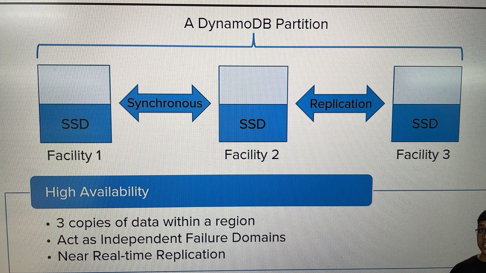

# AMAZON DYNAMODB CONSISTENCY MODEL

## 1. AWS INFRASTRUCTURE

Amazon data centers are hosted in multiple locations worldwide
These locations are composed of *regions* and *availability zones*
Each region is a separate geographic area and each such region has multiple, isolated locations known as availability zones
Further, each availability zone may have one or more facilities (or data centers)

DynamoDB automatically replicates your data between multiple facilities within the AWS region
So, even if a facility experiences failure or downtime, DynamoDB is able to provide a consistent performance at scale

## 2. AUTOMATIC SYNCHRONOUS REPLICATION

To ensure this level of service, DynamoDB stores, at least, 3 copies of your data on high-speed SSDs located in 3 different facilities within the region
Thus, it has, at least, 3 independent failure domains

When the application successfully writes data to a DynamoDB table, it's written to one of these facilities initially and then data is eventually replicated across the other 2 facilities
The first replication of data usually happens within one second or so. The second could takes a long time

As soon as a data is written, if you need to read the data, DynamoDB will only have one copy to provide you with that data with guarantee
In order to provide a good balance, DynamoDB provides you data as per your application's need at the time of querying the data

**High Availability**

- 3 copies of data within a region
- Act as Independent Failure Domains
- Near Real-time Replication

## 3. DYNAMODB READ CONSISTENCY

DynamoDB supports 2 types of read operations: 

- Strongly consistent reads
- Eventually consistent reads

| Read Consistency | Details | Use Case |
| :--------------: | :-----: | :------: |
| Strong Consistency | <ul><li>The most up-to-date data</li> <li>Must be requested explicitly</li></ul> | When the application demands to read the latest copy of data irrespective of when it was written |
| Eventual Consistency | <ul><li>May or may not reflect the latest copy of data</li> <li>Default consistency for all operations</li> <li>50% cheaper</li></ul> | By default, unless you specifically request a <bold>strongly consistent read</bold> |

##

