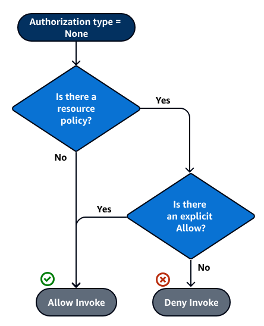

# API GATEWAY ACCESS CONTROL OPTIONS (API KEYS, CLIENT CERTIFICATES, CORS)

## 1. API KEYS
- [1] [API Keys](../../3-Serverless_Foundation-API_Gateway/Docs/6-CreateApiKey.md)
- [2] [Add API Keys to Usage Plans](../../3-Serverless_Foundation-API_Gateway/Docs/7-CreateUsagePlans.md)

## 2. CLIENT-SIDE SSL CERTIFICATES

- Go to *API Gateway Console*
- Choose *Client Certificates*
- Choose *Generate Client Certificate*
- Optionally add a description, and choose *Save*
- Choose *Stages*
- Choose the desired stage
- Under *Client Certificate*, select the created certificate
- Choose *Save Changes*

## 3. SSL CERTIFICATE FOR BACKEND AUTHENTICATION

- Look at references [1] and [2]

## 4. CORS

- At an API method, setup CORS headers in *Integration Response* and *Method Response*
- [1] [Body Mapping Template](../../3-Serverless_Foundation-API_Gateway/Docs/1-BodyMappingTemplate.md)

## 5. RESOURCE POLICIES

- Go to *API Gateway Console*
- Choose *Resource Policy*



### (A) DIFFERENCES FROM IAM POLICIES

| Resource policies | IAM policies |
| :---------------: | :----------: |
| Applied to the API | Attached to the roles or the users of the client application who access the API |

### (B) RESTRICT ACCESS - WHITELIST

| Whitelist | IP Ranges | Source VPC |
| :-------: | :-------: | :--------: |
| Choose *AWS Account Whitelist* | Choose *IP Range Blacklist* | Choose *Source VPC Whitelist* |

### (C) EXAMPLES

- Look at reference [3]

## 6. IAM ROLES AND POLICIES

- Go to *API Gateway Console*
- Choose *Resources*
- Choose the desired resource and its respective method
- Choose *Method Request*
- Under *Authorization*, select *AWS_IAM*
- Deploy the API

### (A) CREATE AN USER

- Go to *IAM*
- Choose *Users*
- Choose *Add user*
- Enter the user details. E.g. User name = 'apigw-user'
- Under *Access type*, select *Programmatic access*
- Choose *Next: Permissions*
- Choose *Next: Review*
- Choose *Create user*
- Take notes about *Access key ID* and *Secret access key*

### (B) ADD INLINE POLICY

- Enter the created user
- Under *Permissions*, choose *Add inline policy*
- Under *Service*, select *Choose a service*
- Search for *ExecuteAPI* Service
- Under *Actions*, inside *Access level*, open *Write* options and select *Invoke*
- Under *Resources*, select *All resources*
- Choose *Review policy*
- Under *Name*, enter a policy name. In this case, *ExecuteAPI*
- Choose *Create policy*

### (C) TEST WITH POSTMAN

- Enter the request URL (HTTP method = GET)
- Under *Authorization*, select type *AWS Signature*
- Enter the following
| AccessKey | SecretKey | AWS Region |
| :-------: | :-------: | :--------: |
| AccessKey save in notes | SecretKey saved in notes | AWS region account |

- Under *Headers*, enter the following
```plaintext
Key = Content-Type
Value = application/json
```

- Send the request

<strong>Ps: When IAM policy and API Gateway resource policy work together, the result could be seen in the <ins>reference [4]</ins></strong>

## 7. AUTHORIZERS

### (A) LAMBDA AUTHORIZERS

```plaintext
- Create a Lambda function to authorize the incoming API requests 
  - similar to a middleware
  - the API request only go through if the Authorizer Lambda allows it to
```

#### i. CREATE LAMBDA AUTHORIZERS

- Go to *Lambda Console*
- Choose *Create function*
- Choose *Use a blueprint* and select *api-gateway-authorizer-nodejs*
- Choose *Configure*
- Under *Basic information*, fill the required fields
| Name | Execution role | Existing role |
| :--: | :------------: | :-----------: |
| lambdaAuth | Select *Choose an existing role* | Select *lambda_basic_execution_role* |

- Choose *Create function*
- Change the nodejs version, if desirable
- Choose *Save*

#### ii. TEST LAMBDA AUTHORIZERS FROM CONSOLE

- Choose *Select a test event*
- Choose *Configure test events*
- Select *Create new test event*
- Under *Event template*, select *API Gateway Authorizer*
- Under *Event name*, enter the desired event name. In this case, *authEvent*
- Substitute the following for your values:

```json
{
  "authorizationToken": "incoming-client-token",
  "methodArn": "arn:aws:execute-api:[region]:[account_id]:[restApiId]/[stage]/[method]/[resourcePath]",
  "type": "TOKEN"
}
```

- Choose *Create*

#### iii. ADD TO API GATEWAY METHODS

<!-- Enabling Lambda authorization by adding Authorizer Lambda function as API authorizer -->
- Go to *API Gateway Console*
- Choose *Authorizers*
- Choose *Create New Authorizer*
- Under *Create Authorizer*, fill the blanks
| Field | Value |
| :---: | :---: |
| Name | LambdaAuthorizer |
| Type | Lambda |
| Lambda Function | lambdaAuth |
| Lambda Event Payload | Token |
| Token Source | Authorization |
| Authorization Caching | Enabled |
| TTL (seconds) | 300 |

- Choose *Create*
- Choose *Grant & Create*

<!-- Add the authorizer to API Gateway method -->

- Go to *API Gateway Console*
- Choose *Resources*
- Choose the desired resource and its respective method
- Choose *Method Request*
- Under *Authorization*, select the authorized previously created. In this case, *LambdaAuthorizer*
- Select the check mark icon
- Deploy the API

#### iv. TEST WITH POSTMAN

- Enter the request URL (HTTP method = GET)
- Under *Authorization*, select type *No Auth*
- Under *Headers*, enter the following
| Key | Value |
| :-: | :---: |
| Content-Type | application/json |
| Authorization | <your_jwt_token> |

- Choose *Save*
- Send the request

#### v. USING LAMBDA AUTHORIZER CONTEXT OBJECT AT BODY MAPPING

- Go to *API Gateway Console*
- Choose *Resources*
- Choose the desired resource and its respective method
<!-- Lambda Authorizer function runs as part of the method request -->
- Choose *Integration Request*
- Scroll down to *Mapping Templates*
- Under *Request body passthrough*, select *When there are no templates defined (recommended)*
- Under *Content-Type*, choose *application/json*
- Enter the following code
```json
{
  "result": "$context.stage",
  "timestamp": "$context.requestTime",
  "userData": {
    "sub": "$context.authorizer.sub",
    "username": "$context.authorizer.name",
    "data": "$context.authorizer.data"
  }
}
```

### (B) AWS COGNITO USER POLL BASED AUTHORIZERS

#### i. CREATE COGNITO USER POOL

- Enter *Amazon Cognito* Console
| Options | Supported by API Gateway ? | Details |
| :-----: | :------------------------: | :-----: |
| User Pools | Yes | |
| Identity Pools | No | Allows setup Federated Identity Access with OpenID Providers (e.g. Google login) |

- Choose *Manage User Pools*
- Choose *Create a user pool*
- Enter a pool name. E.g. *My App*
- Choose *Step through settings*
- Select *Username*
- Uncheck the attributes 
<!-- Just to keep it simple -->
- Choose *Next step*
- At *What password strength do you want to require?* section, under *Minimum length*, enter 8 and only check *Require lowercase letters*
- Choose *Next step*
- Under *Do you want to require verification of emails or phone numbers?*, uncheck all options
- Choose *Next step*
- Choose *Next step*
- Choose *Next step*
- Under *Do you want to remember your user's devices*, choose *No*
- Choose *Next step*
- Choose *Add an app client*
<!-- This will allow us to connect to Cognito from our app and get an identity token for the logged in user -->
- Fill the required fields
| Field | Value |
| :---: | :---: |
| App client name | My App Client |
| Refresh token expiration (days) | 30 |

- Check only *Enable sign-in API for server-based authentication (ADMIN_NO_SRP_AUTH)*
<!-- Allows to create and confirm users using CLI, by passing username and password -->
- Choose *Create app client*
- Choose *Next step*
- Choose *Next step*
- Choose *Create pool*

#### ii. ADD A USER TO A CREATED COGNITO USER POOL (BY CLI)

- Commands

```bash
# Step 1: Sign up to Cognito
aws cognito-idp sign-up --client-id <app_client_id_user_pool> --username <app_client_name> --password <app_client_password>
## e.g. aws cognito-idp sign-up --client-id 39j5ngjn8edfora26pc0isdr64 --username mocah --password pa$sW0rD

# Step 2: Confirm the sign-up
aws cognito-idp admin-confirm-sign-up --user-pool-id <pool_id> --username <user_pool_name>
## e.g. aws cognito-idp admin-confirm-sign-up --user-pool-id us-east-1_3IH2ls4vk --username mocah

# Step 3: Initiate the authentication / Sign the user in
## a. Generate a skeleton
aws cognito-idp admin-initiate-auth --generate-cli-skeleton

## b. Create a json file structure

## c. Enter the following command
aws cognito-idp admin-initiate-auth --cli-input-json file://<filename.json>
### e.g. aws cognito-idp admin-initiate-auth --cli-input-json file://credentials.json

## d. Copy IdToken
```

<strong>Ps: <ins>Look at references [5], [6]</ins></strong>

#### iii. CREATE COGNITO AUTHORIZER IN API GATEWAY (BY CONSOLE)

- Go to *API Gateway Console*
- Choose *Authorizers*
- Choose *Create New Authorizer*
- Under *Create Authorizer*, fill the blanks
| Field | Value |
| :---: | :---: |
| Name | CognitoAuthorizer |
| Type | Cognito |
| Cognito User Pool | My App (cognito user pool created) |
| Token Source | Authorization |

- Choose *Create*

#### iv. TEST CREATED COGNITO AUTHORIZER (BY CONSOLE)

- Choose *Test*
- Under *Authorization Token*, enter the token
- Choose *Test*
- Look at the response
- Choose *Close*

#### v. ADD TO API GATEWAY METHOD (BY CONSOLE)

<!-- Add the authorizer to API Gateway method -->

- Go to *API Gateway Console*
- Choose *Resources*
- Choose the desired resource and its respective method
- Choose *Method Request*
- Under *Authorization*, select the authorized previously created. In this case, *CognitoAuthorizer*
- Select the check mark icon
- Deploy the API

#### vi. TEST WITH POSTMAN

- Enter the request URL (HTTP method = GET)
- Under *Authorization*, select type *No Auth*
- Under *Headers*, enter the following
| Key | Value |
| :-: | :---: |
| Content-Type | application/json |
| Authorization | <your_jwt_token> |

- Choose *Save*
- Send the request

#### vii. USING COGNITO AUTHORIZER CONTEXT OBJECT AT BODY MAPPING

- Go to *API Gateway Console*
- Choose *Resources*
- Choose the desired resource and its respective method
<!-- Lambda Authorizer function runs as part of the method request -->
- Choose *Integration Request*
- Scroll down to *Mapping Templates*
- Under *Request body passthrough*, select *When there are no templates defined (recommended)*
- Under *Content-Type*, choose *application/json*
- Enter the following code
```json
{
  "result": "$context.stage",
  "timestamp": "$context.requestTime",
  "userData": {
    "sub": "$context.authorizer.claims.sub",
    "username": "$context.authorizer.claims['cognito:username']"
  }
}
```
- Redeploy the API

## 8. BIBLIOGRAPHICAL REFERENCES

- [1] Generate and configure an SSL certificate for backend authentication - https://docs.aws.amazon.com/apigateway/latest/developerguide/getting-started-client-side-ssl-authentication.html
- [2] Configure a backend HTTPS server to verify the client certificate - https://docs.aws.amazon.com/apigateway/latest/developerguide/getting-started-client-side-ssl-authentication.html#certificate-validation
- [3] API Gateway resource policy examples - https://docs.aws.amazon.com/apigateway/latest/developerguide/apigateway-resource-policies-examples.html
- [4] Policy evaluation outcome tables - https://docs.aws.amazon.com/apigateway/latest/developerguide/apigateway-authorization-flow.html#apigateway-resource-policies-iam-policies-interaction
- [5] Amazon Cognito user pools - https://docs.aws.amazon.com/cognito/latest/developerguide/cognito-user-identity-pools.html
- [6] AWS Cognito CLI Reference - https://awscli.amazonaws.com/v2/documentation/api/latest/reference/cognito-idp/index.html?highlight=cognito
