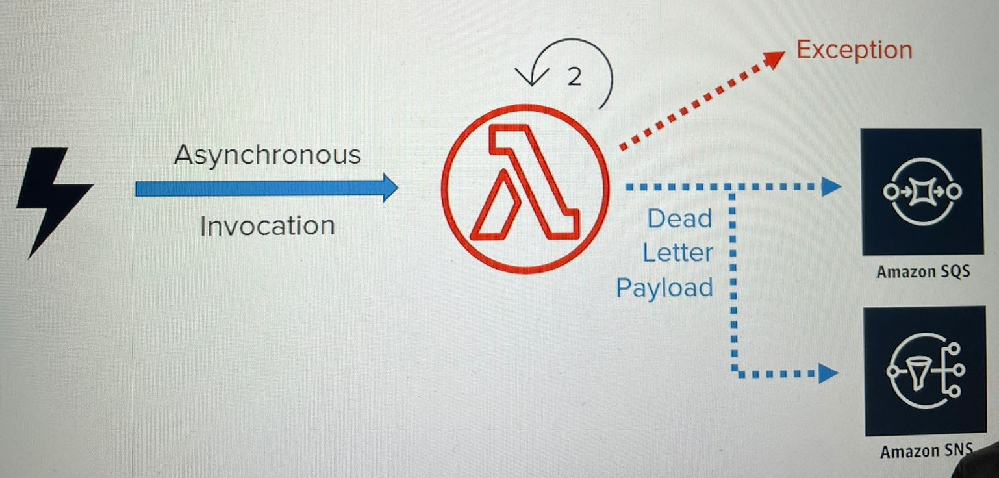
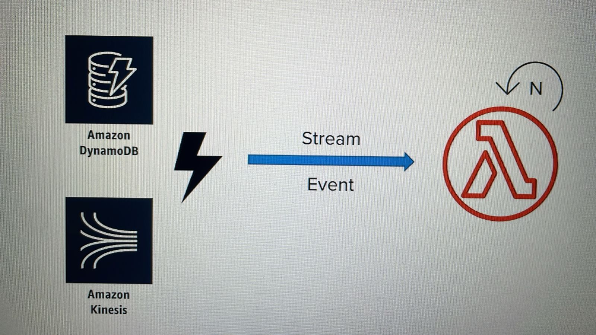
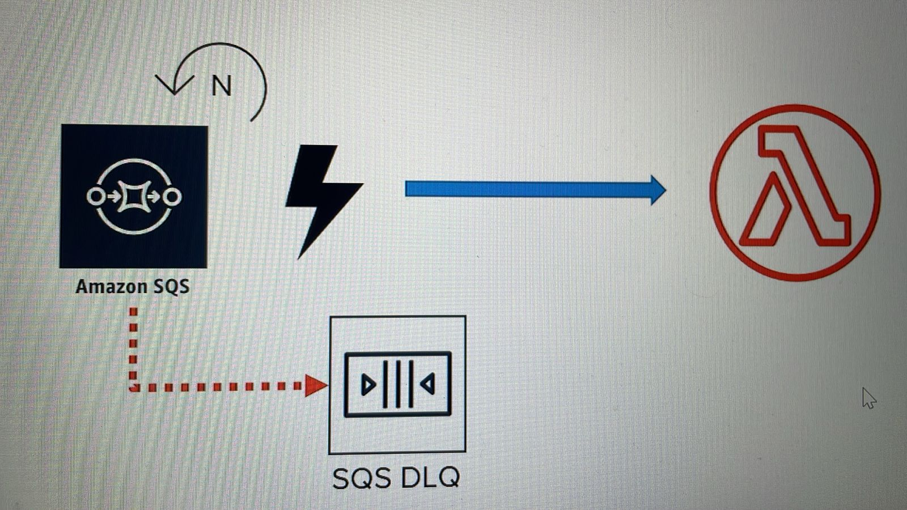

# OVERVIEW OF RETRY BEHAVIOR AND DLQs

## 1. RETRY BEHAVIOR IN AWS LAMBDA

- Lambda functions have built-in retry behavior
- When it fails, AWS Lambda automatically attempts to retry the execution
  - 2 times if invoked asynchronously

### (A) FAIL REASONS

- Logical or syntax code error
- Network outage
- Function hit the timeout
- Function reach run out of memory

### (B) EXCEPTION HANDLER

- Depends on how the function was invoked

| Function invoke mode | Error Handler | Dead Letter Payload |
| :------------------: | :-----------: | :------------------------: |
| Asynchronously | Automatically retries on 2 times (with some delay between) | <ul><li>SQS queue</li> <li>SNS topic (Dead Letter Queue - DLQ)</li></ul> |
| Synchronously | HTTP 429 error | |
| Stream-based events | Automatically retries until data in the stream expires (24 hours to 7 days) | |
| SQS event source | Automatically retains messages from which an error was thrown during processing for future retries | |






#### i. DEAD LETTER QUEUE (DLQ)

- collects the event payload
<!-- Case the function continues to fail after 2nd retry -->
- if not specified, no further action will be done after the 2 attempts

#### ii. STREAM-BASED EVENTS ERROR HANDLER

- Stream events are expected to be processed in order
  - In case of error, it will block the entire queue until the erroneous records either get processed successfully or expire

#### iii. SQS EVENT SOURCE

- Lambda polls the SQS queue and invokes the function
  - For errors while processing messages in SQS queue, those messages are retained in the queue for future retries
  - These will be processed after a pre-configured timeout period (called visibility timeout)
  - If these messages continue to fail, it would be either discarded or sent to the DLQ
    - DLQ here is specific to SQS
    - It must be configured inside SQS

### (C) FORCING A TIMEOUT

- Go to *Lambda Console*
- Enter a desired function
- Configure the function
- Under *Basic settings*, set 2 seconds
- Choose *Save*

### (D) SET AN SQS QUEUE

- Go to *SQS Management Console*
- Choose *Get Started Now*
- Enter the *Queue Name*. In this case, *LambdaDQL*
- Choose an option for the queue. In this case, *Standard Queue*
- Choose *Quick-Create Queue*

#### i. SET THE SQS QUEUE IN LAMBDA FUNCTION

- Go to *Lambda Console*
- Enter a desired function
- In *Debugging and error handling*, under *DQL Resource* choose an option. In this case, *SQS* 
- Under *SQS Queue*, choose an option. In this case, *LambdaDQL*
- Choose *Save*

```bash
Before setting the SQS Queue to a lambda function, guarantee that your role has permission SendMessage for this SQS queue

# Add inline policy => SQS
# Actions => Write - SendMessage
# ARN => copy from SQS queue
```

#### ii. ADD SNS AS A TRIGGER TO THE FUNCTION

**CREATE TOPIC**

- Go to *SNS Management Console*
- Choose *Create topic*
- Enter the following credentials:
|  Field name  |     Value     |
| :----------: | :-----------: |
|  Topic name  | LambdaTrigger |
| Display name |     Lambda    |

**CREATE SUBSCRIPTION**

- After create topic, choose *Create subscription*
- Enter the following values:
|  Field name  |     Value     |
| :----------: | :-----------: |
| Protocol | AWS Lambda |
| Endpoint | dqlTest |

- Choose *Create subscription*

### (E) TEST

#### i. PUBLISH A MESSAGE TO SNS TOPIC

- Go to *SNS Management Console*
- Enter the previous created topic
- Choose *Publish to topic*
- Enter the following values:
|   Field name   |     Value     |
| :------------: | :-----------: |
| Message format | Raw |
|    Message     | Triggering Lambda function DLQ Test |

- Choose *Publish message*

